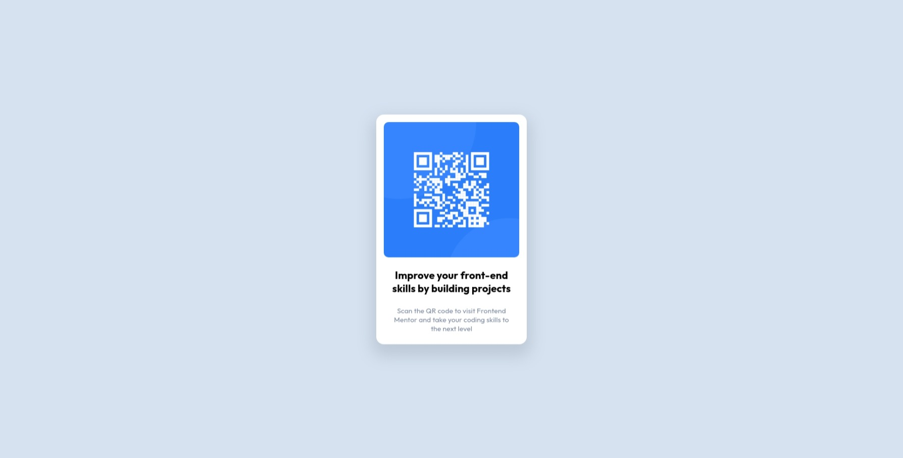
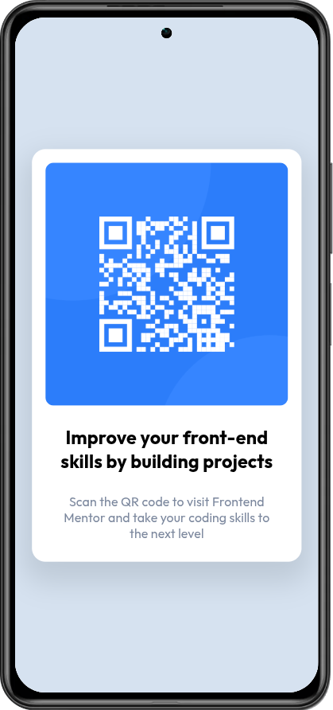

# Frontend Mentor | QR Code Component Solution

This is a solution to the [QR Code Component challenge on Frontend Mentor](https://www.frontendmentor.io/challenges/qr-code-component-iux_sIO_o).

## Table of contents

- [Overview](#overview)
  - [The challenge](#the-challenge)
  - [Screenshot](#screenshot)
  - [Links](#links)
- [My process](#my-process)
  - [Built with](#built-with)
  - [What I learned](#what-i-learned)
- [Author](#author)

---

## Overview

### The challenge

Users should be able to:
- View the optimal layout for the component depending on their device's screen size
- See hover states for all interactive elements on the page

### Screenshot

### Links

- Solution URL: [https://github.com/masrestu/coding-challenges/tree/main/frontend-mentor/qr-code-component](https://github.com/masrestu/coding-challenges/tree/main/frontend-mentor/qr-code-component)
- Live Site URL: [https://fm-qrcodecomponent-stu.netlify.app](https://fm-qrcodecomponent-stu.netlify.app)

---

## My process

### Built with

- Flexbox
- Grid
- Mobile-first workflow

---

## Author
- Github: [@masrestu](https://github.com/masrestu)
- Frontend Mentor: [@masrestu](https://www.frontendmentor.io/profile/masrestu)